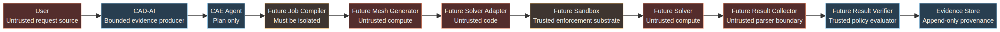

# Phase 6.10 — Pre-Runtime Security & Execution Architecture Review

**Author:** Manus AI  
**Scope:** Review only. No solver, mesher, sandbox, runtime, process, shell, plugin, network, arbitrary filesystem, credential, or numerical-result capability was implemented or enabled.

## Executive conclusion

The implemented Phase 6.9 foundation is materially stronger than a plan-only CAE workflow: new CAE snapshots and canonical jobs require immutable CAD revision/hash bindings; packages require current independently authorized verification and an exact reviewed configuration identity/hash; evidence traceability resolves from CAD through reviewer authorization. The system nevertheless has **no execution substrate**. Its existing runtime review labels resource limits `NOT_CONFIGURED`, sandbox controls `DESIGNED`, hostile tests `NOT_RUN`, and runtime readiness `NOT_READY`. The Phase 6.10 conclusion is therefore **RUNTIME_DESIGN_NOT_READY**. This does **not** authorize a solver, mesher, process, shell, plugin, network, filesystem, sandbox, or numerical result.

> **Decision:** `RUNTIME_DESIGN_NOT_READY`  
> **Execution:** `DISABLED`; `executionEligible=false`; `executable=false`.

## Review evidence and architecture diagram

The review inspected the Phase 6.9 evidence-integrity and package enforcement services, together with the existing runtime-architecture, runtime-readiness, and runtime-implementation-readiness reviews. Current controls are **data and governance controls**, not an execution environment.

```mermaid
flowchart LR
  U[User\nUntrusted request source] --> CAD[CAD-AI\nBounded evidence producer]
  CAD --> CAE[CAE Agent\nPlan only]
  CAE --> JC[Future Job Compiler\nMust be isolated]
  JC --> MG[Future Mesh Generator\nUntrusted compute]
  MG --> SA[Future Solver Adapter\nUntrusted code]
  SA --> SB[Future Sandbox\nTrusted enforcement substrate]
  SB --> SOL[Future Solver\nUntrusted compute]
  SOL --> RC[Future Result Collector\nUntrusted parser boundary]
  RC --> RV[Future Result Verifier\nTrusted policy evaluator]
  RV --> ES[Evidence Store\nAppend-only provenance]
```

The future sandbox must be an independently enforced boundary, not a property claimed by an adapter or solver. OCI bundles explicitly carry host-specific mounts, namespaces, and cgroups, which must be controlled by a trusted runtime manager rather than by an untrusted workload.[1] Container security guidance also identifies host sockets, privileges, capabilities, read/write mounts, and unbounded resources as high-risk control surfaces.[2]

## Trust boundaries

| Component | Current or future role | Trust classification | Required boundary and evidence | Review finding |
|---|---|---|---|---|
| User | Supplies intent, uploads, approvals | **Untrusted** | Strict schemas, size/path/hash validation, explicit human gates | Never receives authority to launch execution. |
| CAD-AI | Produces CAD/requirements evidence | **Partially trusted** | Immutable CAD binding, validated geometry provenance, requirements gating | Phase 6.9 binds CAD project/revision/SHA-256 geometry identity. |
| CAE Agent | Produces non-executable plans and jobs | **Partially trusted** | Approved CAD/requirements/material/load/boundary references; no ambient authority | It must remain unable to invoke solvers directly. |
| Future Job Compiler | Serializes one approved job | **Must be isolated** | Immutable canonical manifest, schema, hashes, no arbitrary file selection | **Not implemented.** |
| Future Mesh Generator | Creates finite-element mesh | **Untrusted** | Fixed adapter/version, isolated process, bounded input/output, quality verifier | **Not implemented.** Viewer tessellation is not a solver mesh. |
| Future Solver Adapter | Converts manifest to solver deck | **Untrusted** | Allowlisted artifact, signature/hash/SBOM, fixed capability contract, no self-granted permissions | Existing configuration records are non-executable only. |
| Future Sandbox | Enforces the workload boundary | **Trusted only after independent evidence** | Kernel-backed isolation, default-deny network, no credentials, no host mounts, enforced limits, attestation | **Designed only; not implemented, verified, or attested.** |
| Future Solver | Performs numerical computation | **Untrusted** | Least privilege, pinned identity, read-only input, bounded output | **Not present.** |
| Future Result Reader | Parses candidate output | **Untrusted boundary** | Size/type/schema limits, no automatic result trust | Parsing must never imply validity. |
| Future Result Verifier | Evaluates deterministic trust gates | **Partially trusted** | Raw artifact hashes, input/CAD/mesh/config/solver identity, units, status, convergence, warnings, provenance | **Not implemented.** |
| Evidence Store | Retains provenance and audits | **Partially trusted** | Append-only records, project isolation, historical retention, immutable references | Current records preserve no-silent-deletion metadata; runtime artifact capture is absent. |

## Threat model

| Threat | Primary boundary | Required control | Current state |
|---|---|---|---|
| Malicious solver artifact / supply-chain compromise | Adapter → sandbox | Pinned artifact hash, signature, SBOM, license review, revocation, independent approval | **Blocker** |
| Malicious mesh / malformed CAD / hostile input | CAD/job/meshing entry | Strict schema, hash, size, topology, and path validation before any workload entry | Partly designed; solver-grade mesh path absent |
| Resource exhaustion / infinite computation / memory exhaustion | Sandbox | Kernel-enforced CPU, memory, storage, timeout, process and file limits; manager termination | **Blocker:** values and enforcement unknown |
| Filesystem escape / path traversal / symlink attack | Sandbox filesystem | No host mounts; read-only input; bounded temporary output; path canonicalization; mount and symlink denial tests | **Designed only** |
| Network exfiltration | Sandbox network | Default deny egress and no published ports; independently tested denial | **Designed only** |
| Credential exposure | Environment / storage / logging | Zero credentials in workload; no inherited environment; redacted bounded logs | **Designed only** |
| Dependency compromise | Build/registry/deployment | Signed provenance, SBOM, vulnerability review, reproducible build and promotion policy | **Blocker** |
| Result tampering / false reporting | Collection → verification → evidence | Hash raw outputs; retain logs; schema/unit/provenance checks; independent human acceptance | Collector/verifier absent |
| Sandbox escape / privilege escalation | Sandbox / host | Rootless or unprivileged workload; capabilities dropped; no privileged mode; seccomp/MAC; hostile testing | **Blocker** |
| Replay / stale evidence | Evidence graph | Revision/hash locks, validity intervals, revocation, nonce/receipt policy | Phase 6.9 helps for pre-runtime evidence; runtime receipt absent |

## Minimum future runtime — one bounded linear-static job

The smallest defensible future scope is **one** approved linear-static structural job: one validated solid CAD revision, one evidence-backed elastic material, one approved boundary set, one approved static load, one verified tetrahedral volume mesh, and one pinned solver/adapter pair. It must exclude contact, nonlinear material, crash/explicit dynamics, optimization, remote execution, automatic design modification, and automatic engineering-result acceptance.

| Dimension | Required future rule | No claim made today |
|---|---|---|
| Inputs | Immutable job manifest, CAD binding, CAE plan, material/load/boundary evidence, reviewed registry configuration, verified mesh | No solver deck is emitted. |
| Outputs | Bounded raw result files, bounded logs, exit receipt, resource receipt; all initially untrusted | No numerical output or result parser exists. |
| Permissions | Read immutable input; write only temporary/output locations; no host control | No permission has been granted. |
| CPU / memory / storage / timeout | Exact policy values must be independently measured, versioned, enforced by the substrate, and exhausted safely | No numeric limits are approved. |
| Network | Default deny; no DNS or egress unless a separate later review approves a narrowly scoped need | No network execution exists. |
| Process | One managed workload tree, non-root, no privilege gain, strict process count; no shell or plugin launching | No process execution exists. |
| Filesystem | Read-only immutable input; isolated bounded temporary workspace; bounded allowlisted outputs; no host mounts or ambient paths | No execution filesystem exists. |

## Future non-executable solver-adapter contract

The interface below is a **design contract**, not an adapter implementation. `executable` remains `false`.

| Field group | Minimum contract fields | Fail-closed rule |
|---|---|---|
| Identity | Adapter ID/version/publisher; solver name/version; artifact and image SHA-256 digests; signature and signer identity | Missing, revoked, unverified, or mismatched identity rejects future authorization. |
| Capability | Exactly `LINEAR_STATIC_STRUCTURAL`; declared element/input/result formats; explicit exclusions | Any undeclared capability or plugin rejects the request. |
| Input | Canonical job manifest hash, mesh hash, material/load/boundary hashes, registry configuration ID/hash/version, units | The adapter may not infer values or read ambient files. |
| Output | Allowlisted filenames/types/maximum sizes, log schema, exit receipt, raw result hashes | Unknown, partial, oversized, or malformed outputs remain invalid. |
| Resources | Versioned CPU/RAM/disk/time/process/file policy references | Policy must be enforced outside adapter control. |
| Verification | Artifact provenance, sandbox attestation, hostile tests, input/output integrity, result trust gates | A successful process exit is insufficient. |

## Future meshing boundary

CAD identity, meshing configuration, mesh artifact, and mesh quality evidence must remain separate immutable records. The future mesher may consume only the exact CAD-bound job geometry and a reviewed bounded meshing configuration. It may emit only a declared mesh artifact and bounded quality report. Mesh quality verification must be current, independently authorized, non-self-reviewed, validity-bounded, and retained. No Phase 6.9 package should be considered a meshing instruction; it is a **non-executable evidence manifest**.

## Result trust model

A future result is not valid because a solver exits successfully. It requires all of the following to pass:

| Mandatory check | Evidence required | Failure behavior |
|---|---|---|
| Input / CAD / mesh identity | Manifest, CAD, mesh, and raw-input hashes | `INVALID` |
| Adapter / solver / configuration identity | Pinned versions, signatures, artifact/image digests, reviewed configuration hash | `INVALID` or refuse display |
| Units and expected schema | Unit manifest and bounded parser checks | Refuse display |
| Exit status and convergence | Managed receipt, log hash, convergence record or documented direct-solution basis | `INVALID` / `UNVERIFIED` |
| Warnings and errors | Preserved warning/error inventory with reviewer disposition | `UNVERIFIED` |
| Result integrity and provenance | Raw result hash, collection receipt, runtime identity, timestamps, full evidence links | Refuse display |
| Human result acceptance | Verified human decision that references the verification record | No accepted engineering result |

## Fail-closed failure model

| Failure | Mandatory future response |
|---|---|
| Timeout, crash, OOM, resource violation | Manager-enforced termination; preserve bounded receipt/logs; invalidate output; no automatic retry. |
| Invalid, corrupt, or partial output | Preserve raw artifact/hash as untrusted forensic evidence; create no trusted result. |
| Input/result hash mismatch | Reject before use or invalidate after collection; preserve diagnostic. |
| Solver/adapter/image version mismatch | Refuse collection, display, reproduction, and result acceptance. |
| Stale CAD/material/verification/configuration | Refuse job creation or package handoff; require new immutable evidence, never silent refresh. |
| Sandbox or network violation | Terminate; preserve immutable incident evidence; suspend/revoke future authorization pending independent review. |

## Human gates

| Future action | Required human decision | Minimum evidence |
|---|---|---|
| Runtime activation | Verified-human authorization | Attested substrate, measured limits, hostile-test evidence, change-control record |
| Solver and artifact approval | Independent security and engineering review | Identity, signature, SBOM, license, vulnerability/revocation review |
| First controlled execution | Explicit job-level approval | Complete immutable job/mesh/package/verification chain and approved limits |
| Production execution | Separate operational approval | Revalidated environment, valid approvals, non-revoked artifacts, current evidence |
| Result acceptance | Engineering reviewer decision | Complete result-trust record, warning disposition, evidence graph |

AI may recommend or summarize evidence, but must never approve an activation, artifact, execution, or result.

## Security decision

| Classification | Controls and findings |
|---|---|
| **Minimum required controls** | Canonical job compiler; solver-grade mesher/quality verifier; signed allowlisted artifact/image; independently attested kernel-backed sandbox; enforced measured resource limits; default-deny network; no credentials/host mounts; bounded collector/parser; deterministic result verifier; immutable artifact receipts; independent hostile-test evidence; human gates. |
| **Critical blockers** | No controlled runtime/job compiler; no mesher; no executable adapter/solver identity; no sandbox; no measured or enforced limits; no collector/verifier; no hostile-test or independent sandbox evidence. |
| **Optional controls** | Remote/hybrid solver capability, multiple solvers, advanced analysis classes, optimization, automatic reporting, and numerical visualization are out of scope for a first runtime. |
| **Unresolved risks** | Container/runtime escape, dependency compromise, parser exploitability, actual capacity behavior, licensing/SBOM obligations, input/output format ambiguity, operator key management, incident response, and production change control. |

## Final decision

`RUNTIME_DESIGN_NOT_READY`

The Phase 6.9 evidence-integrity layer provides meaningful pre-runtime provenance, configuration, authorization, retention, and traceability controls. It does not replace implementation or independent verification of a job compiler, mesher, adapter, sandbox, result collector, verifier, artifact supply chain, or resource enforcement. Execution remains disabled regardless of this design decision.

## Regression evidence

The following review evidence completed without changing execution state:

| Validation | Result |
|---|---|
| `pnpm check` | Passed with zero TypeScript errors. |
| Phase 6.8 governance acceptance suite | **16/16 passed.** |
| Phase 6.9 evidence-integrity acceptance suite | **16/16 passed.** |
| Serialized full regression | **35 test files passed; 122 tests passed; 1 pre-existing authentication test skipped.** |

The tests verify software behavior and fail-closed controls only. They do not constitute solver validation, runtime attestation, hostile-test evidence, or permission to execute.

## References

[1] [Open Container Initiative, *Runtime Specification*](https://github.com/opencontainers/runtime-spec)  
[2] [OWASP, *Docker Security Cheat Sheet*](https://cheatsheetseries.owasp.org/cheatsheets/Docker_Security_Cheat_Sheet.html)  
[3] [NIST, *SP 800-190: Application Container Security Guide*](https://csrc.nist.gov/pubs/sp/800/190/final)
